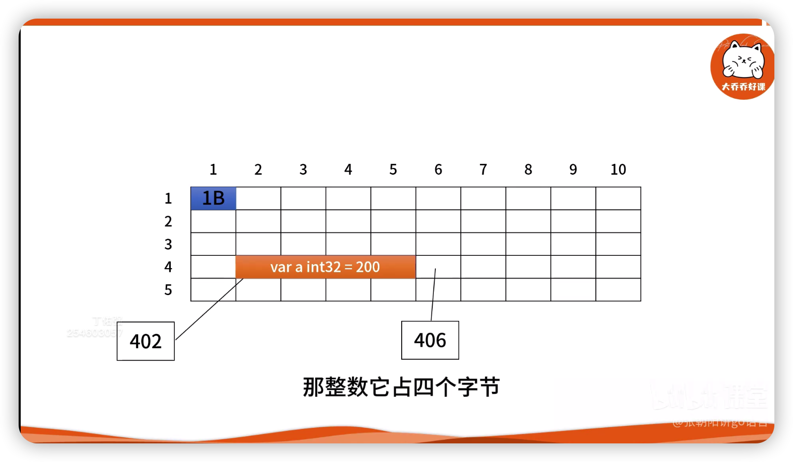

# 数据结构与算法
## go语言指针
- 可以拿着内存唯一的地址去更新里面的值
- 可以把内存想象成二维的格子,
  - 每个格子占一个字节, 一个字节等于八个比特
  - 每个格子都有一个对应的地址
  - 比如说402号格子放着一个整数两百, 整数占四个字节

  
  - 所以402、403、404、405这四个格子存放的就是200这个数字
  - 这里403放着 `b:=false` 的布尔值

  
  - 这里一个布尔变量占一个字节
- 一般来说变量的地址指的是首地址
- 一个变量占几个字节是由变量类型所决定的
- 指针初始化的代码
```go
var p1 *int32 = &a
var p2 *bool = &b
var p3 *byte
```
- 指针的值
```go
p1 == 402
p2 == 406
p3 == nil
```
- 指针本质上是一个地址, 而地址是一个数字
- 指针解析
```go
*p1 == 200
*p2 == false
```
