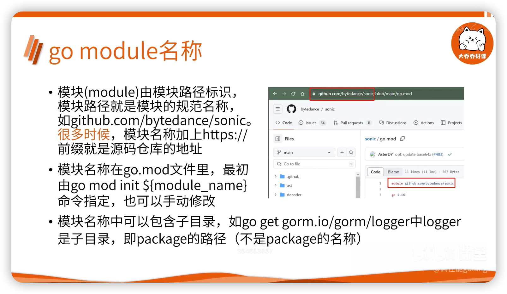

# Go module依赖管理
## go get 如何根据模块名找到源代码
- 模块(module)由模块路径标识
  - 模块路径就是模块的规范名称
  - 如 `github.com/bytedance/sonic`
  - 很多时候模块名称加上 `https://` 前缀就是源码仓库地址
- 模块名称在 `go.mod` 文件里
  - 最初由 `go mod init ${module_name}` 指定
  - 也可以手动修改
- 模块名称中可以包含子目录
  - 如 `go get gorm.io/gorm/logger`
    - 其中 `logger` 是子目录, 即 package 的路径

