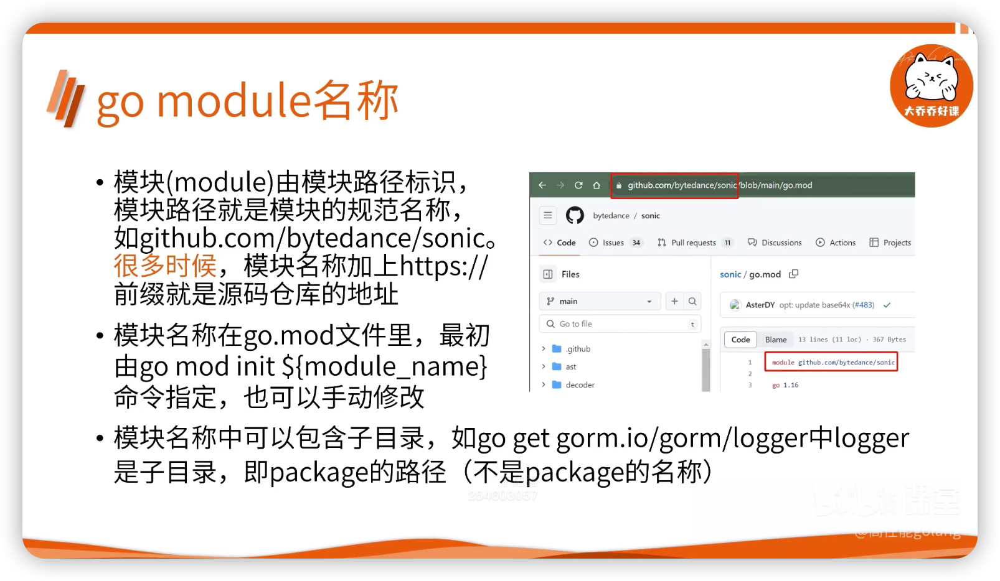
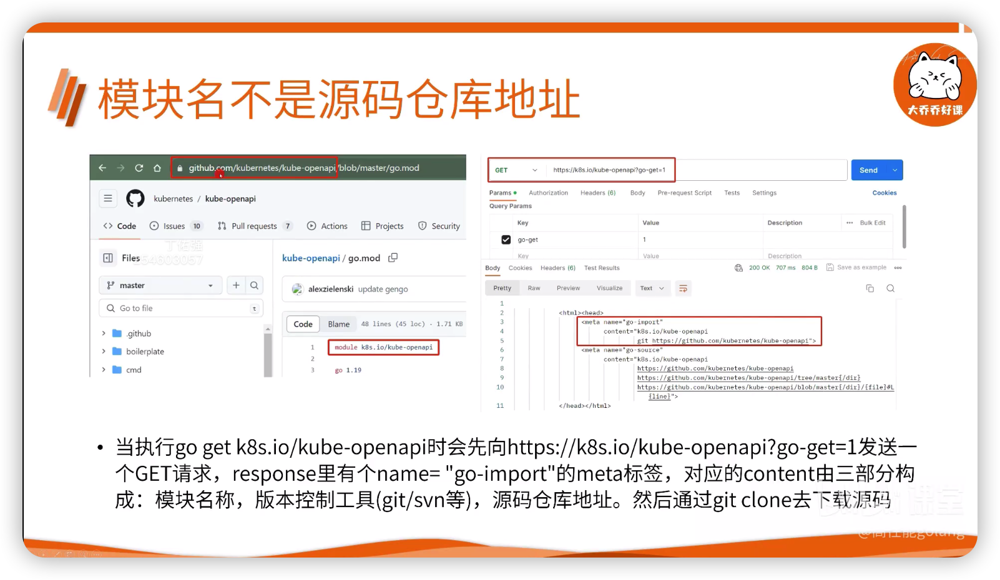
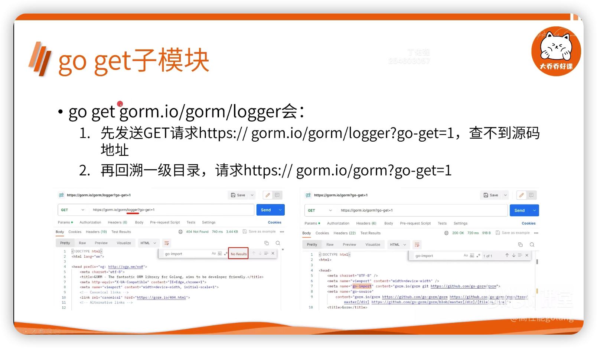
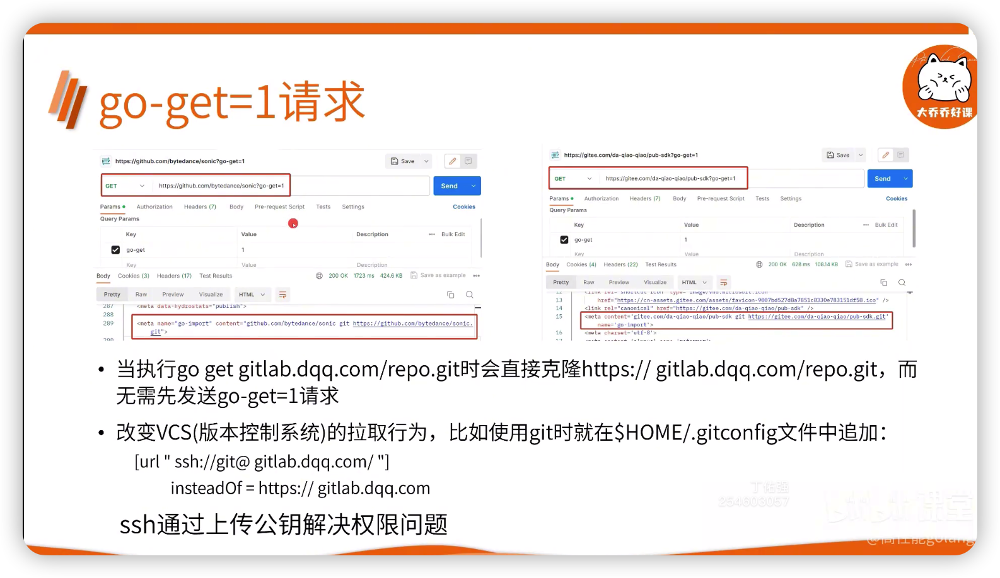
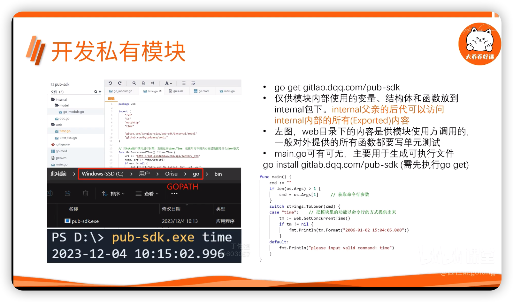

# Go module依赖管理
## go get 如何根据模块名找到源代码
- 模块(module)由模块路径标识
  - 模块路径就是模块的规范名称
  - 如 `github.com/bytedance/sonic`
  - 很多时候模块名称加上 `https://` 前缀就是源码仓库地址
- 模块名称在 `go.mod` 文件里
  - 最初由 `go mod init ${module_name}` 指定
  - 也可以手动修改
- 模块名称中可以包含子目录
  - 如 `go get gorm.io/gorm/logger`
    - 其中 `logger` 是子目录, 即 package 的路径



- 模块名并不是源码仓库地址
- 当执行 `go get k8s.io/kube-openapi` 时会先向 `https://k8s.io/kube-openapi?go-get=1` 发送一个GET请求
  - response 里有个 `name="go-import"` 的meta标签
  - 对应的 content 由三部分组成:
    - 模块名称
    - 版本控制工具(git/svn等)
    - 源码仓库地址
  - 然后通过 `git clone` 去下载源码



- `go get gorm.io/gorm/logger` 会:
  - 先发送 `GET` 请求 `https://gorm.io/gorm/logger?go-get=1`, 查不到源码地址
  - 再回溯一级目录, 请求 `https://gorm.io/gorm?go-get=1`



- 当执行 `go get gitlab.dqq.com/repo.git` 会直接克隆 `https://gitlab.dqq.com/repo.git`
  - 而无需先发送 `go-get=1` 请求
- 改变VCS(版本控制系统)的拉取行为, 比如使用git时在 `$HOME/.gitconfig` 文件中追加:
```
[url "ssh://git@gitlab.dqq.com/"]
  insteadOf = https://gitlab.dqq.com
```
  - ssh通过上传公钥解决权限问题


## 代理与本地缓存
- 如何保证下载速度？如何保证源码安全性和完整性？
- 默认go get并不是直接去源码仓库下载代码
  - 而是用代理 `https://proxy.golang.org`
  - 代理对源码镜像进行了缓存
  - 并提供了CDN加速
  - 源码更新几分钟后, 代理的镜像才会更新, 可能延迟
- 其他代理:
  - https://goproxy.cn
  - https://goproxy.io
- 自定义代理 `go env -w GOPROXY=https://goproxy.io`
  - 或直接设置环境变量
- `https://pkg.go.dev` 周期性监听 `proxy.golang.org` 上的模块索引, 提供go模块和包的检索服务
- 下载的模块会保存到环境变量 `GOMODCACHE` 指定的目录下, 为所有的go项目公用
- GOMODCACHE的默认值为 `$GOPATH/pkg/mod`, 也可以手动修改他
- 模块路径和版本的大写字母用感叹号转义，以避免在不区分大小写的文件系统中发生冲突
- `sum.golang.org`(由谷歌运行) 提供了一个 checksum database, 用于存储源代码的哈希值, 以防止 `go get` 从任何源头(包括代理)拉取了被篡改的源码
  - 第一次 `go get` 时计算其哈希值, 与 `checksum database` 的只进行对比
  - 如果一致则把模块存入本地缓存目录, 并将哈希值写入 `go.sum` 文件
  - 后续使用该模型时通过 `go.sum` 来校验该模块自下载以来未曾被修改过
- 设置 `GOSUMDB=off` 或者 `go get` 时使用 `-insecure`, 表示不需要验证合法性
## 私有module的开发、部署和调用
- 在实际工作中，go module通常用来封装接口API，接口供公司内部调用，所以go module不能发布到公网
- ubuntu上安装gitlba
```shell
sudo apt-get update
sudo apt-get install -y curl openssh-server ca-certificates tzdata perl
sudo apt-get install -y postfix
curl https://packgages.gitlab.com/install/repositories/gitlab/gitlab-ee/script.deb.sh|sudo bash
sudo apt-get install gitlab-ee
# 在/etc/gitlab/gitlab.rb 添加 external_url 'http://gitlab.dqq.com'
sudo gitlab-ctl reconfigure
sudo gitlab-ctl restart
```
### 开发私有模块
- `go get gitlab.dqq.com/pub-sdk`
- 仅供模块内部使用的变量、结构体和函数放到internal包下。internal父亲的后代可以访问internal内部的所有(Exported)内容
- 左图, Web目录下的内容是供模块使用方调用的，一般对外提供的所有函数都要写单元测试
- `main.go` 可有可无，主要用于生成可执行文件 `go install gitlab.dqq.com/pub-sdk(需先执行 go get)`


### GOPROXY=direct
- GOPROXY 可以配置多个。用逗号分隔表示当第一个proxy返回401或404时会访问第二个proxy，用竖线分隔表示当第一个proxy发生任何错误时(如超时)都会访问第二个proxy
- GOPROXY 的默认值为: https://proxy.golang.org,direct。direct表示不走代理，直接从源码库下载(先发送go-get=1请求)
- 所有代理都不会访问私有仓库，所以go get私有模块时会命中direct。为避免下载私有模块时去访问代理，可以把私有模块的前缀赋给GONOPROXY,如GONOPORXY=gitlab.mycorp.com
- git clone私有仓库时通常需要走ssh以解决权限问题
- 私有模块不需要使用公共的checksum数据库。GONOSUMDB=gitlab.mycorp.com表示以gitlab.mycorp.com开头的模块不需要执行checksum
- GOPRIVATE是GONOPROXY和GONOSUMDB的默认值，所以设置GOPRIVATE后就不需要再设置GONOPROXY和GONOSUMDB了

### 部署私有GOPROXY
- goproxy.io 除了提供国内可用的 go module 代理之外，还提供了部署私有go proxy的解决方案
- 编译安装
```shell
git clone https://github.com/goproxyio/goproxy.git
cd goproxy
make
```
- 启动
```shell
./bin/goproxy -listen=0.0.0.0:80 -cacheDir=$home/go_module_cache -proxy https://goproxy.io -exclude "gitlab.mycorp.com"
```
- -cacheDir 是代理使用的缓存目录，跟GOMODCACHE区分开。如果私有代理上找不到模块，则去访问公开代理，-proxy指定公开代理。-exclude指定哪些模块直接去代码仓库下载
- GOPROXY=myproxy.com,direct
